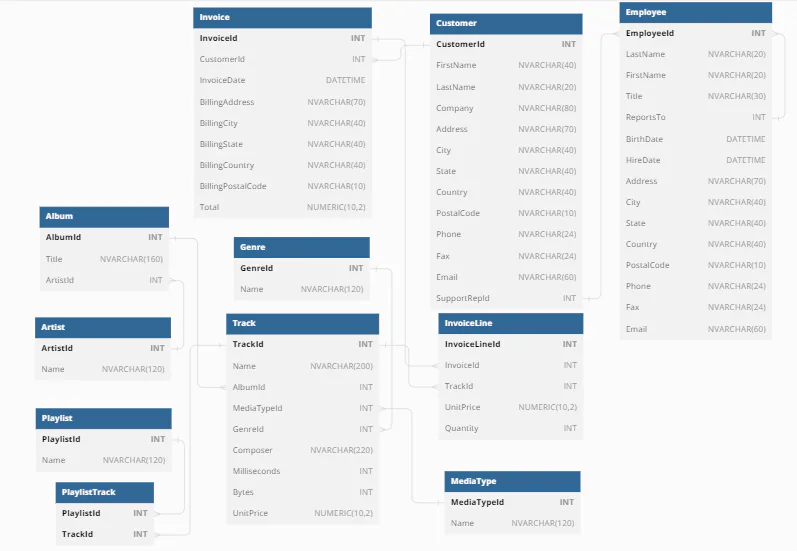

# Stage 4/6: Find playlist duration
## Description
In this stage, let's add the statistics of the playlists for the website interface. We need to find the total length of songs in the playlist. Let's get started!

## Objectives
- You need to calculate the duration of all playlists for the website.
- The duration should be `hh:mm:ss`. You can use the `time()` and `round()` functions for this.
- The duration should be rounded to the whole number. Also, remember that there are playlists with the same name;  
  print the ones with distinct names.
- In the output, playlist `names` should be specified as `playlist_name` and total playing time as `total_time`.  
- The output should be sorted in **descending** order of playing time.
- Print only the **first five** results.

Take a look at the database outline below:  

## Explanation of the database



The ` **Album** ` table:  
- `AlbumId`: INTEGER Primary key,
- `Title`: TEXT
- `ArtistId`: INTEGER Foreign key from `Artist` table

The ` **Artist** ` table:  
- `ArtistId`: INTEGER Primary key,
- `Name`: TEXT 

The ` **Playlist** ` table:  
- `PlaylistId`: INTEGER Primary key,
- `Name`: TEXT

The ` **Genre** ` table:  
- `GenreID`: INTEGER Primary key
- `Name` : TEXT

The ` **MediaType** ` table:  
- `MediaTypeID`: INTEGER Primary key
- `Name` : TEXT

The ` **Track** ` table:  
- `TrackId`: INTEGER Primary key
- `Name`: TEXT,
- `AlbumId`: INTEGER Foreign key from `Album` table
- `MediaTypeID`: INTEGER Foreign key from `MediaType` table
- `GenreID`: INTEGER Foreign key from `Genre` table
- `Composer`: TEXT
- `Miliseconds`: INTEGER
- `Bytes`: INTEGER
- `UnitPrice`: NUMERIC

The ` **PlaylistTrack** ` table:  
- `PlaylistId`: INTEGER Foreign key from `Playlist` table,
- `TrackId`: INTEGER Foreign key from `Track` table 

The ` **Customer** ` table:  
- `CustomerId`: INTEGER Primary key
- `FirstName` : TEXT
- `LastName` : TEXT
- `Company` : TEXT
- `Address` : TEXT
- `City` : TEXT
- `State` : TEXT
- `Country` : TEXT
- `PostalCode` : TEXT
- `Phone` : TEXT
- `Fax` : TEXT
- `Email` : TEXT
- `SupportRepId` : INTEGER

The ` **Invoice** ` table:  
- `InvoiceId`: INTEGER Primary key
- `CustomerId`: INTEGER Foreign key from `Customer` table
- `InvoiceDate` : DATETIME
- `BillingAddress` : TEXT
- `BillingCity` : TEXT
- `BillingState` : TEXT
- `BillingCountry` : TEXT
- `BillingPostalCode` : TEXT
- `Total` : NUMERIC

- The ` **InvoiceLine** ` table:  
- `InvoiceLineId`: INTEGER Primary key,
- `InvoiceId`: INTEGER Foreign key from `Invoice` table
- `TrackId`: INTEGER Foreign key from `Track` table
- `UnitPrice`: NUMERIC Foreign key from `Track` table
- `Quantity`: INTEGER

The ` **Employee** ` table:  
- `EmployeeId`: INTEGER Primary key
- `LastName` : TEXT
- `FirstName` : TEXT
- `Title` : TEXT
- `ReportsTo` : INT
- `BirthDate` : DATETIME
- `HireDate` : DATETIME
- `Company` : TEXT
- `Address` : TEXT
- `City` : TEXT
- `State` : TEXT
- `Country` : TEXT
- `PostalCode` : TEXT
- `Phone` : TEXT
- `Fax` : TEXT
- `Email` : TEXT

Playlists are located in the `Playlist` table. Music tracks are located in the `Track` table. These two tables are related  
to the `PlaylistTrack` table. The duration of the tracks is given in milliseconds in the `Milliseconds` column.

## Example
```markdown
playlist_duration = "SELECT DISTINCT(playlist_name),total_time FROM ..."
```